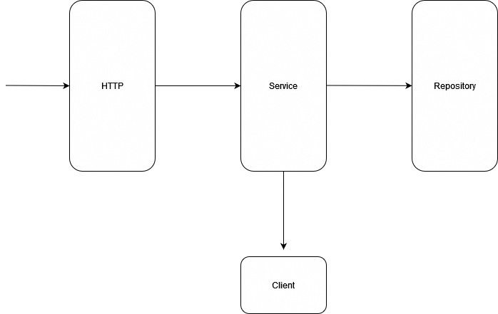

# Golang REST API with Clean Architecture

## Architeture Overview

## How to run

### Prerequisite

- [Task](https://github.com/go-task/task)
- [Docker](https://www.docker.com/)
- [Docker Compose](https://docs.docker.com/compose/)

### Run one of the [tasks](./Taskfile.yml):

- build
- tests
- run
- integration-test
- acceptance-tests
